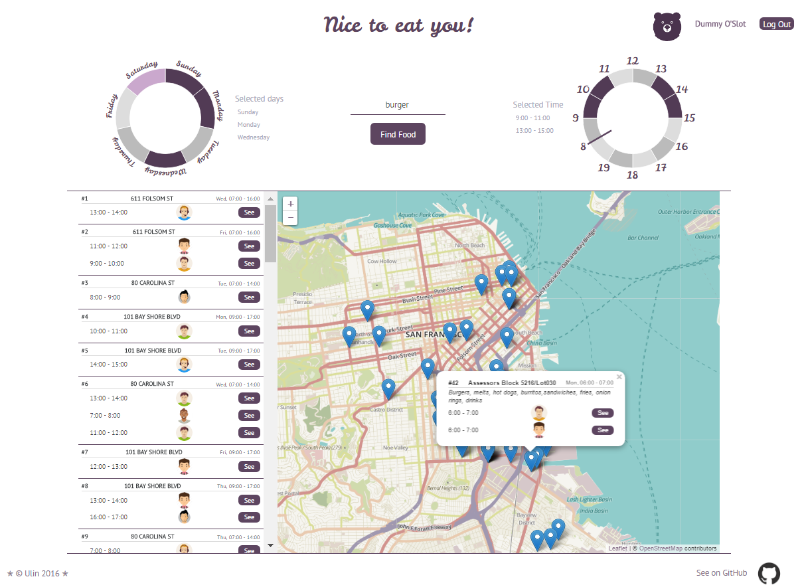

# Foodpoints-Demo
Demo app on React/Redux. It uses [react-circular-timepicker](https://github.com/gooduling/react-circular-timepicker) - graphic UI control to pick the time.

This is just a prototype of my earlier idea to make a pretty tool which allows people to have a lunch together.
I had to do some emulations to make first steps.
 So I used a dataset of "Mobile Food Schedule" from a https://data.sfgov.org/Economy-and-Community/Mobile-Food-Schedule/jjew-r69b
Lets imagine there are not just a food trucks, but may be a cute cafeterias there 😉   - with it's schedule and locations in San Francisco. Now you can find them on a map (filtered by day, time or dishes) and you can choose any of them to see if somebody proposed to have a lunch there. If yes, you can join this appointment or leave it. Also you are able to see the profiles of other users. You need to login (I hardcoded user and password for you) or sign In with a new user to start. 
I didn't have a backend-part yet, so I just emulated other users and their propositions with a random values. They are stored in a LocalStore of your browser like in a real database.

[See Demo](https://gooduling.github.io/foodpoints-demo)

## Requirements
- ``` $ node -v ``` is a **^4.2.0**

- ``` $ npm -v ``` is a **^3.0.0**


## Instalation
```
$ git clone https://github.com/gooduling/foodpoints-demo.git
$ cd foodpoints-demo
$ npm install 
```


## Development

- ``` $ develop:build ``` - Provide **compiled**, and **minified** bundles to 'public' directory.

- ``` $ npm run develop:devserver ``` - Runs the project in development mode with hot-reloading of 'public' folder. Open your browser at http://localhost:3030.

- ``` npm run test ``` - Runs tests **once** with Mocha(server side interpretation). Entry point: **'test/setup.js'**.

- ``` npm run test:watch ``` - **Continuously** watch changes and run tests immediately after changes.

- ``` npm run lint ``` - Runs eslint checker **once**. Entry point: **'.eslintrc'**.

- ``` npm run lint:watch ``` - **Continuously** watch changes and run Run eslint checker immediately after some changes.

- ``` npm run clear ``` - Remove 'public' and 'node_modules' folders.


### Code standart
- [`AirBnb code style`](https://github.com/airbnb/javascript)

##### keywords: [`#react-circular-timepicker`](https://github.com/gooduling/react-circular-timepicker) [`#Redux`](https://github.com/rackt/redux) [`#React`](https://facebook.github.io/react/) [`#ES2015`](http://www.ecma-international.org/ecma-262/6.0/) [`#Webpack`](https://webpack.github.io) [`#Babel`](https://babeljs.io) [`#Mocha`](https://mochajs.org) [`#Chai`](http://chaijs.com)

 
